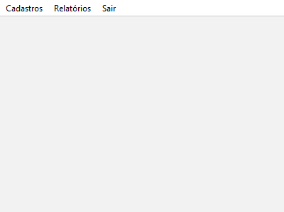
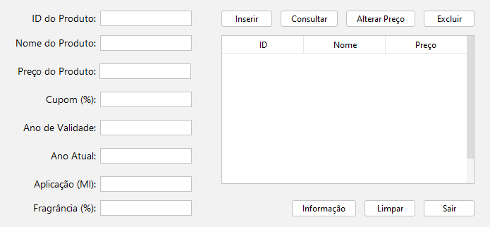
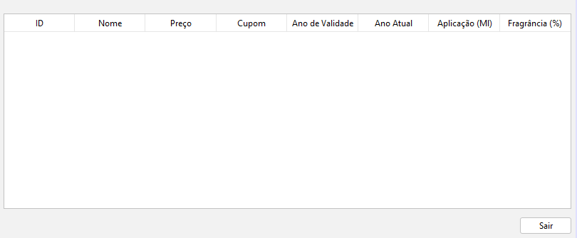
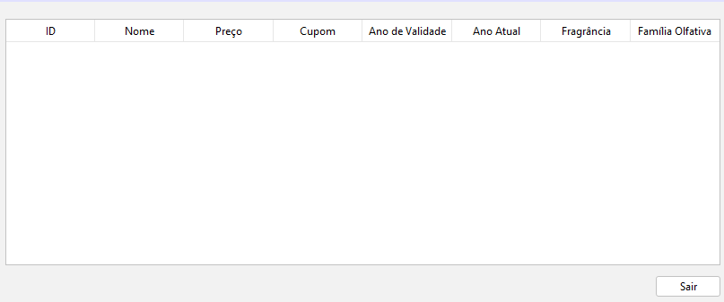

# Perfumery System

This project is a management system for a perfumery, developed as part of the coursework for the Object-Oriented Programming class. The system is implemented in Java and incorporates all the basic OOP concepts such as inheritance and polymorphism. Additionally, it features a graphical user interface developed in NetBeans.

## Table of Contents

- [About the Project](#about-the-project)
- [Features](#features)
- [Technologies Used](#technologies-used)
- [How to Run](#how-to-run)
- [Screenshots](#screenshots)
- [Author](#author)

## About the Project

The goal of this project is to create a comprehensive system for managing a perfumery, allowing for product registration, sales tracking, and more. The project is developed using Object-Oriented Programming (OOP) principles to ensure modular, reusable, and maintainable code.

## Features

- Product registration (Perfume, Moisturizer, and BodySplash)
- Sales tracking
- Sales reports for each product category
- Product validity calculation
- Discount calculation with coupon
- User-friendly graphical interface

## Technologies Used

- **Programming Language:** Java
- **IDE:** NetBeans
- **OOP Concepts:** Inheritance, Polymorphism, Encapsulation, Abstraction

## How to Run

1. Clone the repository to your local machine.
    ```sh
    git clone https://github.com/your-username/perfumery-system.git
    ```
2. Open the project in NetBeans.
3. Compile and run the project from the IDE.

## Project Structure

- **src:** Source code directory
- **screenshots:** Directory containing screenshots of the application

## Screenshots

### Main Screen



### Product Registration Screen (Each product has a specific screen, the example shown is for BodySplash)



### Sales Report Screen (Each product has its own report, the example shown is for BodySplash)



### General Sales Report Screen (Report of sales for all products)



## Author

- **Name:** Marjory Mel Ferreira Ferro Lemos
- **Email:** marjorymel48@gmail.com
- **LinkedIn:** [LinkedIn](https://www.linkedin.com/in/marjory-mel-ferreira-ferro-lemos-68b969208)

---

Project developed for the Object-Oriented Programming course - Universidade Tecnológica Federal do Paraná (UTFPR).
